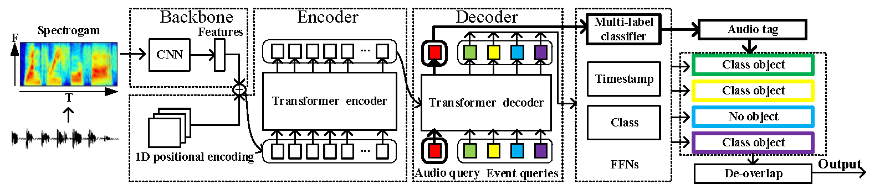
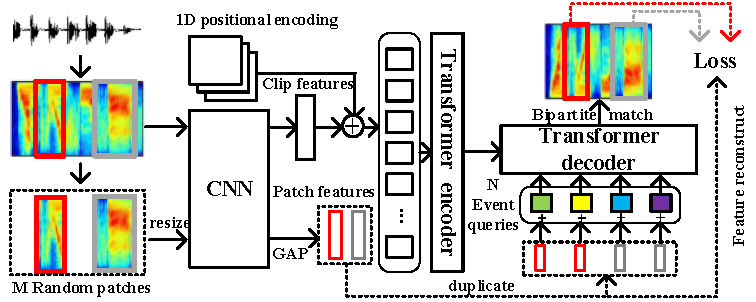

# Sound Event Detection Transformer

## Prepare your data
+ URBANSED Dataset  
  Download [URBAN-SED_v2.0.0](https://zenodo.org/record/1324404/files/URBAN-SED_v2.0.0.tar.gz?download=1) dataset, and 
  change $urbansed_dir in config.py to your own URBAN-SED data path. To generate *.tsv file, run
    ```python
    python ./data_utils/collapse_event.py
    ```

 
+ DCASE2019 Task4 Dataset  
Download the dataset from the website of [DCASE](http://dcase.community/), and change $dcase_dir in config.py to your own
 DCASE data path. 

## Train models
+ To train model on the dataset of URBANSED, run
    ```shell script
    python train_sedt.py
              --gpus $ngpu
              --dataname urbansed
              --batch_size 64
              --fusion_strategy 1 
              --dec_at 
              --weak_loss_coef 1
              --epochs 400 # total epochs
              --epochs_ls 280 # epochs of learning stage
              --lr_drop 160
              --num_queries 10
    ```

## Evaluate models
+ For URBAN-SED dataset, download our [SEDT(E=3, Eb_F1=38.15)](https://drive.google.com/file/d/1X7PEZzPH61W1KCFAyLN6RspvIfabb2H-/view?usp=sharing), put it in ./exp/urbansed/model/ , then run
     ```shell script
    python train_sedt.py --gpus 0 --dataname urbansed --dec_at --fusion_strategy 1 --num_queries 10 --eval --info URBAN-SED
    ```

# SP-SEDT: Self-supervised Pretraining  for SEDT 

## Prepare your data
+ DCASE2018 Task5 development dataset  
  Download [the dataset](https://zenodo.org/record/1247102), put the audios in $dcase_dir/audio/train/ and the *.tsv file
   in $dcase_dir/metadata/train/
## Train models
+ To train backbone by audio tagging task, run
    ```shell script
    python train_at.py --dataname dcase --gpu $ngpu --pooling max
    ```
You can also download our [backbone](https://drive.google.com/file/d/1R-hAnM6cW1Q9TvLBqROrTxOp4T99Ih76/view?usp=sharing), and put it in ./exp/dcase/model/
+ To pretrain SEDT on a single node with $N gpus, run
    ```shell script
    python -m torch.distributed.launch --nproc_per_node=$N train_spsedt.py  
                --gpus $ngpu 
                --dataname dcase
                --batch_size 200
                --self_sup
                --feature_recon
                --num_patches 10 
                --num_queries 20
                --enc_layers 6 
                --epochs 160 
                --pretrain "backbone" # file name of the backbone model 
                --checkpoint_epochs 20
    ```
You can also download our models pretrained [with](https://drive.google.com/file/d/1iYykmwu0Imuoypb30IQDRWIf-_3F7mXu/view?usp=sharing) or [without](https://drive.google.com/file/d/1TpR0YhmPxVYyJ0HOm1tn4AnYPqZe442-/view?usp=sharing) dcase2018 task5 data,
and put it in ./exp/dcase/model/
+ To fine-tune SEDT, run
    ```shell script
    python train_sedt.py 
              --gpus $ngpu 
              --dataname dcase 
              --batch_size 32 
              --n_weak 16 
              --num_queries 20
              --enc_layers 6 
              --dec_at 
              --fusion_strategy 1 
              --epochs 300 
              --pretrain "Pretrained_SP_SEDT" 
              --weak_loss_coef 0.25
    ```
## Evaluate models  
  Download our [SP-SEDT(E=6, Eb_F1=39.03)](https://drive.google.com/file/d/1JIhvRpvW6MC7N88PxCVQ8BpckaAYLDDU/view?usp=sharing), put it in ./exp/dcase/model/ , then run

```shell script
python train_sedt.py 
          --gpus $ngpu 
          --dataname dcase
          --num_queries 20 
          --enc_layers 6 
          --dec_at 
          --fusion_strategy 1 
          --eval 
          --info SP_SEDT
```
# DCASE challenge system
A SP-SEDT-based system is constructed with mixup, frequency mask, frequency shift and time mask as data augmentation methods, and hybrid pseudo-labelling/mean-teacher as semi-supervised learning method where a teacher model is updated from the student model online using exponential moving average strategy and used to generate hard pseudo labels for unlabeled data.
## Train models
+ To prepare a teahcer model with weak and synthetic subsets, download [SP-SEDT(E=6)](https://drive.google.com/file/d/1TpR0YhmPxVYyJ0HOm1tn4AnYPqZe442-/view?usp=sharing) pretrained with only dcase2019 unlabel subset, put it in ./exp/dcase/model/, then run
```shell script
python train_sedt.py 
          --gpus $ngpu 
          --dataname dcase
          --batch_size 64 
          --n_weak 32 
          --num_queries 20
          --enc_layers 6 
          --dec_at 
          --fusion_strategy 1 
          --epochs 400 
          --pretrain "Pretrained_SP_SEDT_unlabel" 
          --weak_loss_coef 0.25 
          --freq_mask 
          --freq_shift
          --mix_up_ratio 0.6
```
You can also download our [teacher model (EB_F1=40.88)](https://drive.google.com/file/d/15EGgn6tKnQ9AUHPzAzlEBeCzslMVPvLs/view?usp=sharing), put it in ./exp/dcase/model/
+ To semi-supervised train SEDT with additional unlabel subset, run
```shell script
python train_ss_sedt.py 
            --gpus $ngpu
            --dataname dcase
            --num_queries 20
            --enc_layers 6
            --dec_at
            --fusion_strategy 1
            --epochs 400
            --teacher_model "teacher_model_40.88" # file name of the teacher model 
            --weak_loss_coef 0.25
            --freq_mask
            --freq_shift
            --time_mask
            --focal_loss
            --mix_up_ratio 0.6
```
## Evaluate models
Download our [SP-SEDT(E=6, Eb_F1=51.75)](https://drive.google.com/file/d/1e9x4ZY5WccoYmwhlErr5a1PhAtvdSPL0/view?usp=sharing), put it in ./exp/dcase/model/ , then run
```shell script
python train_ss_sedt.py 
          --gpus $ngpu 
          --dataname dcase
          --num_queries 20 
          --enc_layers 6 
          --dec_at 
          --fusion_strategy 1 
          --eval 
          --info SP-SEDT-system
```
## Related papers
```
@article{2021Sound,
  title={Sound Event Detection Transformer: An Event-based End-to-End Model for Sound Event Detection},
  author={ Ye, Zhirong  and  Wang, Xiangdong  and  Liu, Hong  and  Qian, Yueliang  and  Tao, Rui  and  Yan, Long  and  Ouchi, Kazushige },
  year={2021},
}
@article{2021SP,
  title={SP-SEDT: Self-supervised Pre-training for Sound Event Detection Transformer},
  author={ Ye, Z.  and  Wang, X.  and  Liu, H.  and  Qian, Y.  and  Tao, R.  and  Yan, L.  and  Ouchi, K. },
  journal={arXiv e-prints},
  year={2021},
}
```
